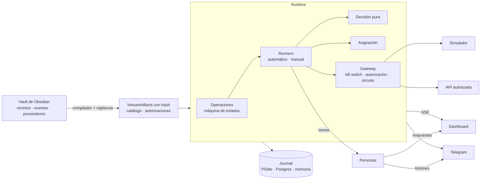

---
tags:
  - sistema
---

# Arquitectura

## Piezas

| Pieza | Dónde | Qué hace |
|---|---|---|
| Contratos | `shared/src` | Tipos de dominio, API/SSE, esquemas de entrada, reglas de la máquina de estados |
| Compilador del vault | `server/src/vault` | Lee las notas, valida, genera artefactos con hash; vigila cambios |
| Dominio puro | `server/src/domain` | Resolución de etiquetas, política, validación, candidatos, **decisión**, **asignación**, límites, readiness |
| Proveedores | `server/src/providers` | Registro con guardarraíles, [[Simulador]], [[Asistencia manual]] |
| Runtime | `server/src/runtime` | Operaciones, runners, claims, carritos, cuentas/sesiones, tareas humanas, alertas, seguridad, métricas, replay |
| Journal | `server/src/store` | Write-behind a PGlite (por defecto), Postgres o memoria |
| API | `server/src/http` | REST + stream SSE + dashboard compilado |
| Dashboard | `dashboard/src` | React: sala de control en tiempo real |
| Gates / bench | `server/src/gates`, `server/src/cli` | Simulaciones con reloj virtual |

## Principios

- **Speed-first sin atajos**: el camino caliente (decidir → reservar → enviar) no espera a disco ni a la red más de lo imprescindible. Ver [[Métricas y SLO]].
- **Determinismo**: la decisión es una función pura; todo lo que la alimenta queda en el journal. Ver [[Replay y auditoría]].
- **Fail-closed**: ante la duda, no se actúa. Ver [[Uso legítimo y guardarraíles]].
- **Human-in-the-loop**: retos, pagos y todo lo manual lo hacen personas. Ver [[Claims, carritos y confirmación]].
- **Reloj inyectable**: el mismo código corre en tiempo real o con reloj virtual (gates en milisegundos).
