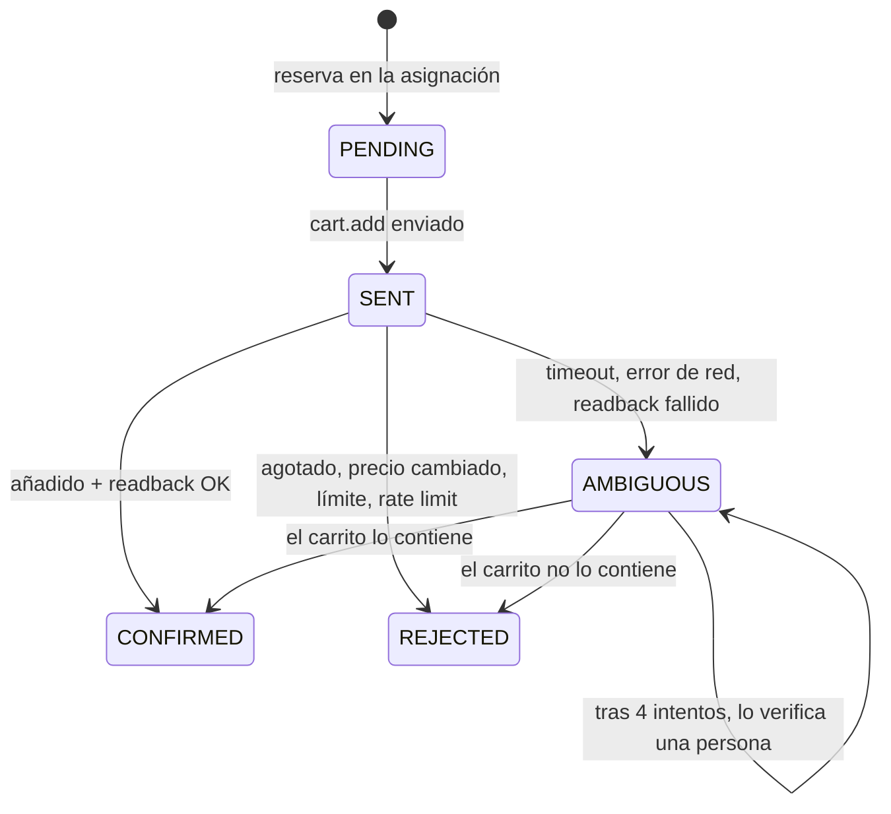

---
tags:
  - sistema
---

# Claims, carritos y confirmación

- **Idempotencia**: cada claim lleva una clave; si se repite la petición, el proveedor devuelve el mismo resultado.
- **Confirmación mínima** por proveedor: `ACK` (su respuesta), `READBACK` (leyendo el carrito, el simulador) o `HUMAN` (una persona lo confirma).
- **Ambiguo nunca libera**: la reserva se mantiene hasta saber la verdad. Reconciliación automática con `cart.read` a los 0,4 s, 0,8 s, 1,6 s y 3,2 s; después, tarea humana *Verificar carrito*.
- **Rechazado**: la oferta se marca como no disponible unos segundos para no volver a pedirla.

## Carritos

- Uno por cuenta y operación; acumula las entradas confirmadas.
- Avisos de caducidad configurables (por defecto 300, 120 y 60 s).
- Si caduca con la operación aún en marcha, ese cupo vuelve a la asignación.
- **Pagado** y **Liberado** solo los marca una persona. Ver [[Pago y cierre]].

## Asistencia manual

En vez de `cart.add`, el runner crea una tarea **Añadir al carrito** para una cuenta con la mejor sección pendiente (en orden de preferencia), la cantidad que le toca y el precio máximo, reservando esa capacidad. La persona responde *en carrito* (cantidad y precio reales), *no pude* (se prueba la siguiente zona) o *no sé* (se pide verificación). Si no responde a tiempo (3 min), se trata como ambiguo.
