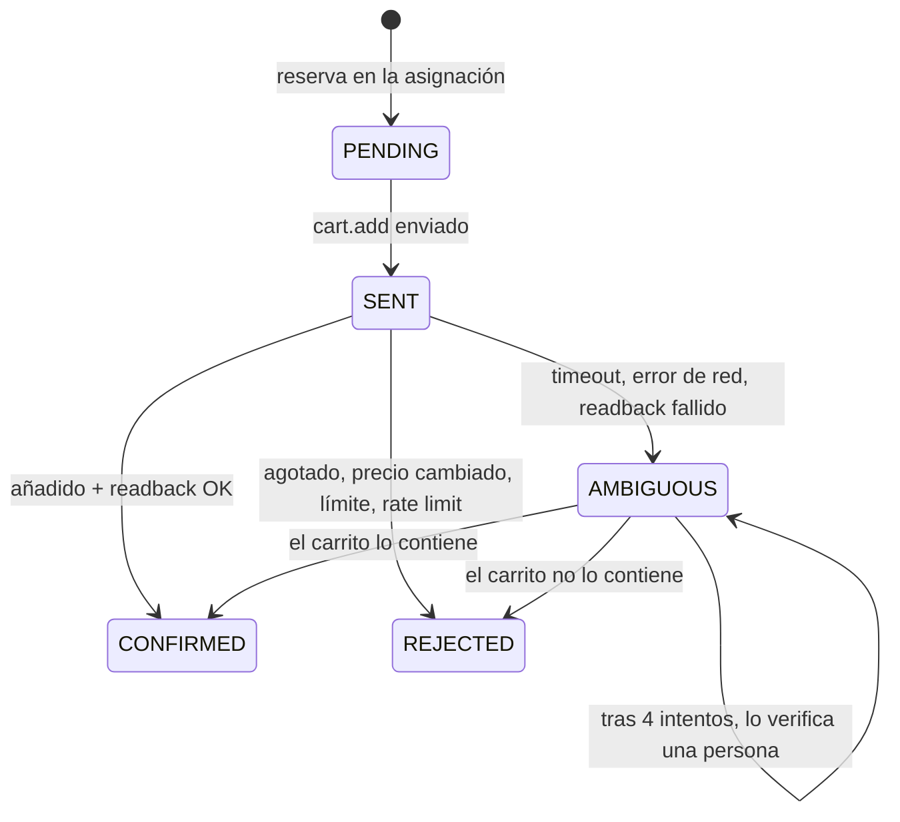

---
tags:
  - sistema
---

# Claims, carritos y confirmación

- **Idempotencia**: cada claim lleva una clave; si se repite la petición, el proveedor devuelve el mismo resultado.
- **Confirmación mínima** por proveedor: `ACK` (su respuesta), `READBACK` (leyendo el carrito, el simulador) o `HUMAN` (una persona lo confirma).
- **Ambiguo nunca libera**: la reserva se mantiene hasta saber la verdad. Reconciliación automática con `cart.read` a los 0,4 s, 0,8 s, 1,6 s y 3,2 s; después, tarea humana *Verificar carrito*.
- **Rechazado**: la oferta se marca como no disponible unos segundos para no volver a pedirla.

## Carritos

- Uno por cuenta y operación; acumula las entradas confirmadas.
- Avisos de caducidad configurables (por defecto 300, 120 y 60 s), si el carrito tiene hora de caducidad.
- **Confirmado por una persona** (`HUMAN`, asistencia manual): la hora la da la persona y es una estimación, así que el carrito **no caduca solo** ni se vuelve a repartir por su cuenta. Al llegar la hora queda abierto, sigue contando y salta una alerta crítica «…: se acabó el tiempo del carrito, ¿lo has pagado?». Se responde con **Ya lo he pagado** (`PAID`), con más minutos (la hora se fija de nuevo y los avisos se reinician) o con **Liberar** (`RELEASED`: se perdió).
- **Confirmado por el proveedor** (`ACK`/`READBACK`, el simulador): al llegar la hora pasa a `EXPIRED` («Carrito caducado»). Un carrito caducado aún se puede marcar como pagado («Lo pagué a tiempo»): su cantidad vuelve a contar (`COMMIT_EXTERNAL`).
- **Liberado o caducado** con la operación aún viva (en marcha, pausada, recuperando o con carrito asegurado): esa cantidad vuelve a la asignación (`UNCOMMIT`) y se reparte de nuevo mientras la operación esté en ejecución. Si estaba en *Carrito asegurado* y su ventana sigue abierta, vuelve a *En ejecución*; con la ventana ya cerrada, se queda en *Carrito asegurado*.
- **Pagado** y **Liberado** solo los marca una persona. Ver [[Pago y cierre]].

## Asistencia manual

En vez de `cart.add`, el runner crea una tarea **Añadir al carrito** para una cuenta con la mejor sección pendiente (en orden de preferencia), la cantidad que le toca y el precio máximo, reservando esa capacidad. Reparte **en paralelo**: la cantidad de cada tarea deja lo que queda sin asignar en 0 o en al menos un grupo mínimo, para que otra cuenta lista vaya a por ello a la vez (4 entradas, límite 3 por persona, grupo mínimo 2 → 2 + 2).

La persona responde *en carrito* (cantidad y precio reales), *no pude* (se prueba la siguiente zona) o *no sé* (se pide verificación). El runner reacciona a cada respuesta, sin esperar a su revisión periódica de 250 ms: tras *no pude*, o tras «no está» en la verificación, la siguiente zona sale al momento. Si alguien dijo *no sé* y otra persona responde después *en carrito* a esa misma tarea, la respuesta se aplica a la verificación abierta. Si nadie responde a tiempo (**30 min** por defecto, `MANUAL_TASK_MINUTES`), se trata como ambiguo: la reserva se mantiene y se pide verificación.

Cada compra exige «Sesión lista» de nuevo: al armar, las cuentas de asistencia manual que estaban listas vuelven a *Sin sesión* y reciben una tarea «Inicia sesión» nueva con el plan. Desarmar cancela esas tareas.
