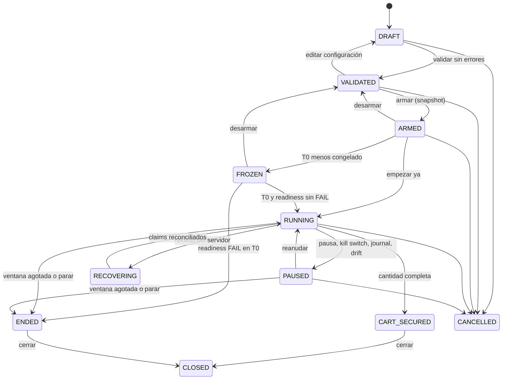

---
tags:
  - sistema
---

# Máquina de estados de una operación

| Estado | En el dashboard | Qué se puede hacer |
|---|---|---|
| `DRAFT` | Borrador | Editar, validar, cancelar |
| `VALIDATED` | Validada | Editar (vuelve a borrador), armar, readiness, cancelar |
| `ARMED` | Armada | Desarmar, empezar ya, readiness, reducir cantidad, bajar precio, cancelar |
| `FROZEN` | Congelada | Igual que armada + parar |
| `RUNNING` | En marcha | Pausar, parar, reducir cantidad, bajar precio, cancelar |
| `PAUSED` | Pausada | Reanudar, parar, reducir cantidad, bajar precio, cancelar |
| `RECOVERING` | Recuperando | Pausar, parar, cancelar |
| `CART_SECURED` | Asegurada | Cerrar (tras pagar) |
| `ENDED` | Finalizada | Cerrar |
| `CANCELLED`, `CLOSED` | — | Nada: estados finales |

Las reglas viven en `shared/src/rules.ts` y las comparten servidor y dashboard: el dashboard solo muestra los botones que el servidor aceptará.

## Por tiempo (scheduler, cada 250 ms)

- Fases de readiness T−12 h, T−1 h, T−5 min (si se arma tarde, solo la más reciente).
- `ARMED → FROZEN` a `T0 − freezeLeadSeconds`.
- `FROZEN → RUNNING` en T0 (o `ENDED` con motivo `READINESS_FAILED`).
- `RUNNING/PAUSED → ENDED` al agotarse la ventana.
- T0 se **compensa** con el desfase medido del reloj del proveedor.

## Configuración congelada

Desde `ARMED` la configuración no se edita. Solo se admiten **enmiendas conservadoras**: reducir la cantidad y bajar el precio máximo.
